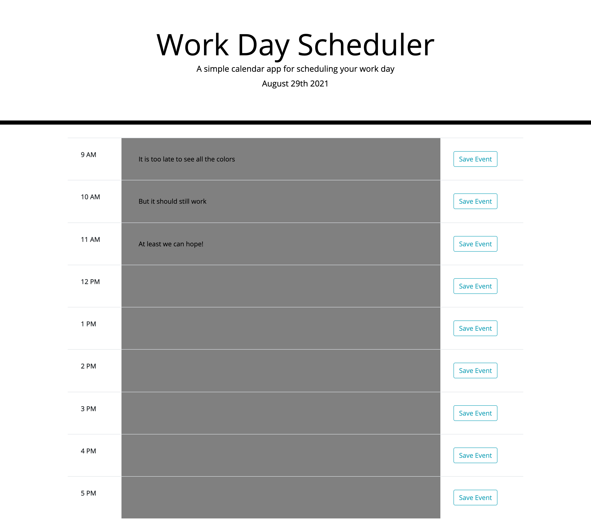

# Work Day Scheduler
## Description
A daily planner that allows you to add important events in order to help manage time more effectively
## Goals
- The current day is displayed at the top of the calendar
- Time blocks are displayed for standard business hours
    - Each block is color-coded for past, present, or future
    - By clicking on a time block, and event can be entered
    - Saving an event in a time block saved the text for that event in local storage
- Saved events persist when the page is refreshed
## To Use
- Page should load with current time, and each block should be colored depending on the time
    - Past: Grey
    - Present: Green
    - Future: Blue
    - Colors reset the following day
- Enter tasks by clicking on the colored part of the date
- Click the save button to save to localStorage
    - There is probably a better way to do this, but in order to display data through refresh was to set the text as placeholder

